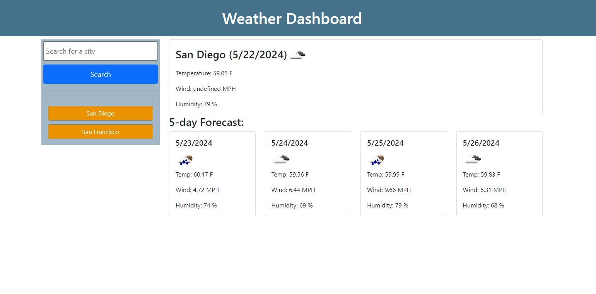

# Weather Dashboard

This is a simple Weather Dashboard application that allows users to search for current and future weather conditions of a city using the OpenWeatherMap API. The application also keeps a history of searched cities, allowing users to easily view past searches.

## Features

- Search for a city to get current and future weather conditions
- Display current weather conditions including:
  - City name
  - Date
  - Icon representation of weather conditions
  - Temperature
  - Humidity
  - Wind speed
- Display a 5-day weather forecast including:
  - Date
  - Icon representation of weather conditions
  - Temperature
  - Wind speed
  - Humidity
- Store and display a history of searched cities
- Click on a city in the search history to view its current and future weather conditions again

## Screenshot

 - Main Page

### Prerequisites

- An API key from OpenWeatherMap. You can obtain it by signing up on their [website](https://api.openweathermap.org).

### Installation

1. Clone the repository:
    ```bash
    git clone https://github.com/AlexCapilla/weather-dashboard.git
    cd weather-dashboard
    ```

2. Open `index.html` in your preferred web browser.

### Usage

1. Enter a city name into the search input field and click the search button.
2. View the current weather conditions and the 5-day forecast for the city.
3. Click on any city name in the search history to quickly view its weather information again.

### Configuration

Update the `apiKey` variable in your JavaScript file with your OpenWeatherMap API key:
```javascript
const apiKey = 'YOUR_API_KEY';
```

### License

This project is licensed under the MIT License.
